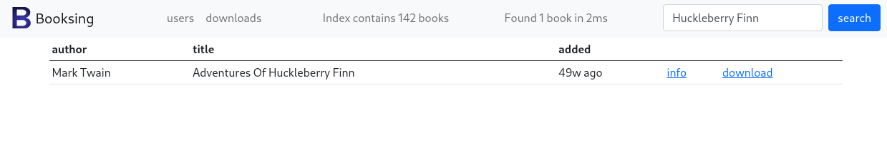
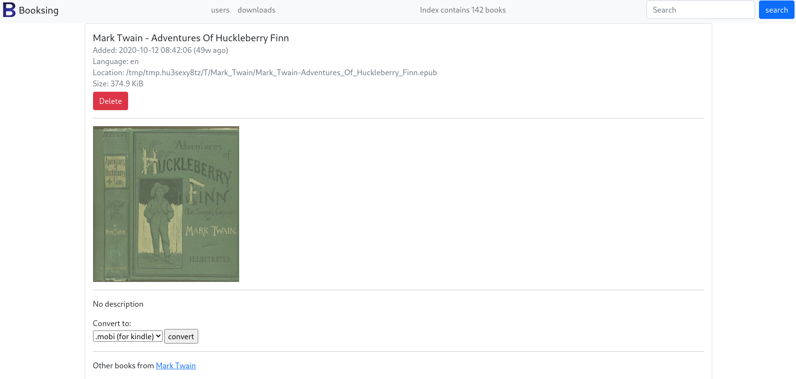

# booksing

A tool to browse epubs.

Kind of inspired by https://github.com/geek1011/BookBrowser/

## Installation
Download an appropriate release from the [release](https://github.com/gnur/booksing/releases) page

## screenshots


  


## Features
- Easy-to-use
- List view
- Light weight, blazing fast, static html web interface, that even works on the terrible kindle browser
- Automatic deletion of duplicates and unparsable epubs
- Automatic sorting of books based on Author
- See what books have been downloaded
- If you have an authenticating proxy booksing can determine the username from a header, and the admin user will be able to grant users access.
- can convert .epub into .mobi for kindle reading

## Requirements
- (optional) calibre to enable .epub to .mobi conversion

## Configuration

Set the following env vars to configure booksing:

| env var               | default                | required           | purpose                                                                                                                  |
|-----------------------|------------------------|--------------------|--------------------------------------------------------------------------------------------------------------------------|
| BOOKSING_ADMINUSER    | `unknown`              | :x:                | This determines the admin user, the only user that can login by default unless `allowallusers` is set to true            |
| BOOKSING_ALLOWALLUSERS | `true`                | :x:                | This determines whether all users can login                                                                              |
| BOOKSING_BINDADDRESS  | `localhost:7132`       | :x:                | The bind address, if external access is needed this should be changed to `:7132`                                         |
| BOOKSING_BOOKDIR      | `./books/`             | :x:                | The directory where books are stored after importing                                                                     |
| BOOKSING_DATABASEDIR  | `./db/`                | :x:                | The path to put the database files (sqlite based)                                                                        |
| BOOKSING_FAILDIR      | `./failed`             | :x:                | The directory where books are moved if the import fails                                                                  |
| BOOKSING_IMPORTDIR    | `./import`             | :x:                | The directory where booksing will periodically look for books                                                            |
| BOOKSING_LOGLEVEL     | `info`                 | :x:                | determines the loglevel, supported values: error, warning, info, debug                                                   |
| BOOKSING_MAXSIZE      | `0`                    | :x:                | If set, any epub larger than this size in bytes will be automatically deleted, can be useful with limited diskspace      |
| BOOKSING_TIMEZONE     | `Europe/Amsterdam`     | :x:                | Timezone used for storing all time information                                                                           |
| BOOKSING_USERHEADER   | `-`                    | :x:                | The header to take the username from (if behind cloudflare access, this should be: `Cf-Access-Authenticated-User-Email`) |


## Tips
- For large collections, it is perfectly acceptable to place the ebooks themselves on an external USB drive, but you should place the database dir on a faster (preferable SSD) disk.
- The database file is regular sqlite, so you can just copy and paste it to make a backup, and use sqlite3 cli to explore the database
- Booksing does not try to create directories to place its sqlite database, or any of the other directories, please create them yourself.
- Regular search is kind of fuzzy thanks the sqlite's full text search. You can also use advanced queries like:
  - `author:Mark Twain, title:the adventures of tom sawyer`
  - `author:mark twain`

## Example first run

```

$ mkdir booksing booksing/failed booksing/import booksing/db 
$ cd booksing
$ wget 'https://github.com/gnur/booksing/releases/download/v9.0.5/booksing_9.0.5_linux_x86_64.tar.gz'
$ tar xzf booksing*
$ mkdir books db failed import
$ ./booksing &
$ mv ~/library/*.epub import/
# visit localhost:7132 to see the books in the interface
```

## systemd unit file
There is an example systemd unit file available on the releases page, can also be found in `includes/booksing.service`
